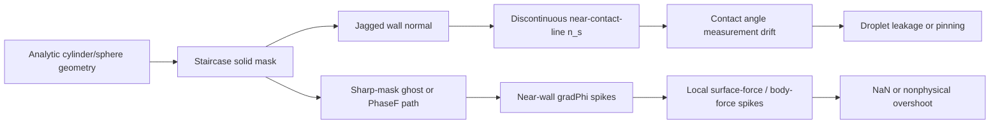

# Stage17B Curved Wetting Key Audit Handoff

Date: 2026-06-24

Source: user-provided deep audit text in `C:\Users\yuanz\.codex\attachments\103098d0-e3b6-4278-8735-f55fd321edc0\pasted-text.txt`.

Purpose: preserve the critical Stage17B curved-wetting audit conclusions so future agents or engineers do not lose the decision context after conversation compaction.

## Non-Negotiable Conclusion

Do not abandon the phase-field route. The current evidence says the next structural repair is not another local patch to the old staircase `WallGhost` or curved compact-write path. The repair must change how curved solid boundaries are represented and diagnosed:

```text
analytic SDF -> diffuse solid indicator psi_s -> smooth normal n_s
-> shadow ghost diagnostics -> controlled write gate only after shadow gates pass
```

The repository status remains:

```text
exploratory_not_validation
```

Therefore no document, script, or result may claim:

```text
contact angle validation passed
cylinder/sphere wetting fixed
dynamic impact basis ready
PhaseF write path authorized
```

unless the corresponding gates below have actually passed.

## Two Main Lines Must Stay Separate

The project now has two interacting but separate problem lines.

### Line A: Stage17B Curved Boundary Geometry/Wetting

Scope:

```text
curved solid geometry consistency
diffuse-solid psi_s
smooth wall normal n_s
shadow-only ghost
explicit controlled write gate
static cylinder and sphere contact-angle validation
```

This line is about curved-wall representation and wetting reconstruction.

### Line B: Stage14-74 High-Density-Ratio Closure

Scope:

```text
stress/F_mu
ForceOverRho
pressure closure
force/rho feedback
phase-advection velocity coupling
```

Stage14-74 evidence indicates that for `wall_60to30_10` at density ratio 200 (`Density_h=1.0`, `Density_l=0.005`), the earliest strong failure is not `tmp1/Fphi`. The early failure appears through `ForceOverRho` and `stress/F_mu` feedback. In the recorded evidence chain, `ForceOverRho` jumps to about `2483.13` by step 13 while `tmp1` and `FphiMaxAbs` are still close to normal scale.

This line must not be mixed into Stage17B implementation. If density-ratio-200 closure still fails after curved-wall shadow gates pass, that is not proof that diffuse-solid geometry is wrong. It means the Stage14-74 closure lane remains open.

## Why The Curved-Wall Route Changed

The likely curved-wall failure chain is:



The direct implication is that the core Stage17B target is not a new local `q_w(theta)` tweak. The target is a coherent geometry-to-boundary chain:

```text
signed distance d(x)
diffuse solid psi_s = 0.5 * (1 - tanh(d / (sqrt(2) * eps_s)))
grad psi_s
smooth solid-to-fluid normal n_s
bounded shadow ghost
write permission only inside a guarded near-wall band
```

## Current Stage17B Status After B1/B2

B1 has already been committed:

```text
b7bd10a stage17B add diffuse solid sdf offline gate
```

Meaning:

```text
offline analytic SDF / diffuse-solid geometry gate passed
plane/cylinder/sphere geometry can be regenerated by script
shadow ghost is still offline evidence, not TCLB write authorization
```

B2 has already been committed:

```text
6384f96 stage17B add diffuse solid shadow-only gate
```

Meaning:

```text
TCLB Stage17B shadow-only fields are implemented in an independent snapshot
P100 1000-step cylinder shadow cases passed for theta 60/90/120
Psi*/NearWall* fields are output-only
PhaseF and WallGhost are not written by Stage17B
```

B2 evidence:

```text
run root: /mnt/usb1t/RUNS/runs/stage17B_shadowtheta_cylinder_20260624
binary sha256: 411d72fb9ff45cb799bfda4b6b33a0761ee5903b1e00c484c7578894be766aee
local evidence: artifacts/stage17B_B2_shadow_20260624/runtime_shadowtheta/
status: PASS_STAGE17B_B2_SHADOW_DIAGNOSTICS
```

Important correction from B2:

```text
legacy AnalyticCylinder radAngle must stay neutral at 90d
Stage17BShadowThetaDeg is the diagnostic theta sweep
```

The earlier run that used legacy curved `radAngle=60/120` polluted the legacy wetting path and is a negative control, not accepted B2 evidence.

## Guardrails For Any Future Patch

These must remain true until a separate gate explicitly changes them:

```text
Stage17BDiffuseSolidMode default = 0
Stage17BWriteMode default = 0
Stage17BShadowThetaDeg default = -1
Stage17BWriteMode=0 never writes PhaseF
Stage17BWriteMode=0 never writes WallGhost
curved compact direct-write remains blocked
flat compact write gate remains:
  stage13_compact_write_requested() && (AnalyticSolidType < 1.5)
```

Stage17B must not reuse flat-wall compact-write permission. Flat-wall compact ghost is a regression baseline, not an experimental area for curved-wall work.

Any future controlled-write route needs a new path identity, for example a distinct `WettingPathId`, and must be independently auditable.

## Required Gate Order

Do not skip gates:

1. B2 cylinder shadow 2000 steps.
2. B2 cylinder shadow 12000 steps.
3. B2 sphere shadow diagnostics.
4. B3 controlled write design, still default-off.
5. B3 negative-control and positive-control source audit.
6. B4 cylinder static validation.
7. B5 sphere static validation.
8. Only then low-We dynamic preflight.
9. Only after static curved wetting is closed should dynamic impact be discussed.

Suggested cylinder validation order:

```text
theta = 60, 90, 120
do not start from 30 degrees
```

Suggested sphere validation order:

```text
theta = 90, 60, 120, 30
do not run sphere 30 degrees until the first three sphere cases pass
```

## B3 Controlled-Write Design Constraints

B3 must be a new explicit mode, not an implicit extension of B2.

Required behavior:

```text
default remains shadow-only
controlled write only inside Stage17BWriteMode > 0
write allowed only when band_ok && normal_ok && stencil_ok
write path must not reactivate old curved compact direct-write
write path must record a distinct path id
```

Minimal pseudocode intent:

```c
if (Stage17BDiffuseSolidMode > 0.5 && AnalyticSolidType >= 1.5) {
    sd = analytic_signed_distance(...);
    psi_s = 0.5 * (1.0 - tanh(sd / (sqrt(2.0) * Stage17BPsiEps)));
    grad_psi = grad_psi_from_sdf(...);
    n_s = smooth_solid_to_fluid_normal(grad_psi);

    normal_ok = norm(grad_psi) > Stage17BGradPsiMin;
    band_ok = fabs(sd) <= Stage17BWriteBand;
    stencil_ok = fluid_side_stencil_ok(...);

    PsiSolid = psi_s;
    PsiGradMag = norm(grad_psi);
    PsiNormal = n_s;
    PsiWallGhost = bounded_shadow_wall_ghost(...);
    PsiWriteAllowedFlag = band_ok && normal_ok && stencil_ok;

    if (Stage17BWriteMode > 0.5 && PsiWriteAllowedFlag > 0.5) {
        WallGhost = PsiWallGhost;
        WettingPathId = 170.0;
    }
}
```

This is a permission model as much as a wetting formula. It separates:

```text
flat compact write
legacy analytic ghost
Stage17B shadow
Stage17B controlled write
```

## Build And Runtime Caveats

Do not trust partial TCLB generation when settings or fields change. Use explicit RT generation in the compile lane. Prior evidence showed that `make .../source` alone can leave generated source/header mismatches.

Required build principle:

```text
clean target directory
full source generation
explicit tools/RT generation for Dynamics.c
then CUDA build
record binary sha256
```

Runtime lane:

```text
server: yuan@192.168.1.16
GPU: CUDA_VISIBLE_DEVICES=1
compile lane: /home/yuan/src/TCLB_lbm2026_compile_lane
run storage: /mnt/usb1t/RUNS/runs/
```

Do not download or commit large VTI files unless specifically needed. Commit lightweight evidence:

```text
analysis JSON
frames CSV
run logs/status/stderr
binary hash
manifest
source audit JSON
```

## What Not To Do

Do not use these as main repair routes:

```text
DynamicCL tuning
ForceCap tuning
Mobility M tuning to hide a defect
old Stage12 BC claims
legacy curved compact direct-write
WallGhost local patching without geometry normal audit
direct We-impact runs
cylinder-array pickup/deposition runs
claiming B2 shadow output as contact-angle validation
```

These may be useful later as diagnostics or negative controls, but not as the current main repair path.

## Literature And Reference Priority

Use literature to support the implementation logic, not to bypass TCLB semantics.

Highest-priority references to keep in mind:

```text
TCLB-related phase-field curved wetting work:
  curved surfaces require geometry and wetting boundary consistency;
  staircase approximation is a known source of error.

Frank et al. jagged/voxel surface phase-field boundary work:
  non-90 degree contact angles are systematically biased by jagged surfaces;
  boundary surface-energy correction motivates replacing sharp/jagged geometry.

Huang et al. 2022 curved simplified wetting boundary:
  close to conservative Allen-Cahn phase-field LBM with curved wetting;
  useful as Stage17B supporting evidence, not a direct copy target.

Sugimoto et al. 2026 compact-stencil wetting for 3D curved surfaces:
  compact stencil is not the problem by itself;
  geometry and normal construction are the decisive parts.

Chinese curved-surface contact-angle measurement papers:
  useful for B4/B5 post-processing and error definition,
  not as the primary solver boundary implementation.
```

FluidX3D/OpenLB can be useful as engineering or conceptual references, but they should not replace the TCLB-specific stage/streaming/field semantics audit.

## Minimal Next Action

The next safe engineering step after the current B2 commit is:

```text
run Stage17B cylinder shadow cases to 2000 steps on P100
analyze with stage17B_shadow_analyze.py
commit only lightweight artifacts
if passed, run 12000-step cylinder shadow
only then plan sphere shadow diagnostics
```

Do not open B3 controlled write until B2 cylinder long shadow and sphere shadow diagnostics are coherent.

## One-Sentence Handoff

Stage17B is the curved-geometry/wetting reconstruction lane; Stage14-74 is the high-density-ratio momentum/pressure/stress closure lane. They meet through `PhaseF`, but they must not be repaired in the same patch series.
