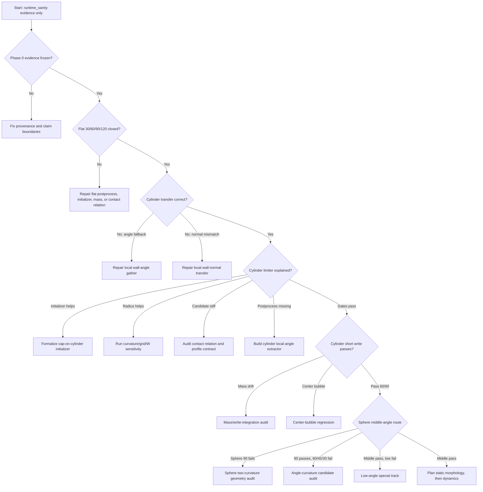

# Wetting Decision Tree

Status: `runtime_sanity / exploratory_not_validation`.

This document defines the routing tree for plane, cylinder, sphere, low-angle,
center-bubble, and dynamic morphology wetting work. It is a planning document
only. It does not authorize GPU jobs, write mode, sphere11, 50k runs, or solver
physics changes.

## Top-Level Rule

The project must move from easier evidence to harder evidence:

```text
flat wall -> cylinder -> sphere -> low-angle special route -> dynamics
```

Each branch below has a stop condition. A stopped branch must produce a
diagnostic packet or report before additional runs are planned.

## Main ASCII Tree

```text
Start
 |
 |-- Phase 0 evidence freeze incomplete
 |      -> fix documentation/provenance first
 |
 |-- Flat 30/60/90/120 does not close
 |      |
 |      |-- theta_fit unknown or unstable
 |      |      -> repair flat contact-angle postprocessing
 |      |
 |      |-- limiter high
 |      |      -> audit contact relation on flat wall
 |      |
 |      |-- mass drift high
 |      |      -> mass-conservation audit
 |      |
 |      |-- center bubble appears
 |             -> free-droplet and bulk/initializer regression
 |
 |-- Flat 30/60/90/120 closes
        |
        |-- Cylinder transfer audit fails
        |      |
        |      |-- local wall angle wrong or fallback high
        |      |      -> repair wall-angle gather
        |      |
        |      |-- wall normal disagrees with analytic cylinder radial normal
        |             -> repair local wall-normal transfer
        |
        |-- Cylinder transfer audit passes
               |
               |-- Cylinder initializer audit shows cap-like init improves limiter
               |      -> formalize cap-on-cylinder or tangent-plane cap initializer
               |
               |-- Cylinder radius increase improves limiter
               |      -> plan curvature / grid / interface-width sensitivity
               |
               |-- Cylinder postprocessor cannot extract local angle
               |      -> repair contact-line and local-angle extractor
               |
               |-- Cylinder candidate remains stiff after transfer/init/R checks
               |      -> audit contact relation and profile/candidate contract
               |
               |-- Cylinder shadow and geometry gates pass
                      |
                      |-- Cylinder short write generates mass drift
                      |      -> write-integration and mass-conservation audit
                      |
                      |-- Cylinder short write generates center bubble
                      |      -> center-bubble regression for curved wall
                      |
                      |-- Cylinder 60/90 short write passes
                             |
                             |-- Sphere 90 fails
                             |      -> sphere geometry/normal/angle transfer or
                             |         two-curvature audit
                             |
                             |-- Sphere 90 passes but 60/45/30 fail
                             |      -> contact relation curvature/angle coupling
                             |
                             |-- Sphere middle angles pass but low angles fail
                             |      -> route to low-angle special track
                             |
                             |-- Sphere middle angles pass
                                    -> plan static morphology, then dynamic route
```

## Explicit Branch Table

| Event | Interpretation | Required action | Stop condition |
| --- | --- | --- | --- |
| Flat fails | No reliable baseline exists | Repair flat postprocessing, initializer, or wall candidate | Stop cylinder/sphere work |
| Flat theta is unknown | Evaluation method is incomplete | Implement robust spherical-cap fitting and contact-line extraction | No write claim |
| Flat limiter remains high | Contact relation is still too stiff even without curvature | Audit relation before curvature work | No curved write |
| Flat mass drift high | Boundary or phase-field conservation issue | Mass-conservation audit | No 50k |
| Free droplet has center bubble | Bulk or initializer issue | Free-droplet regression | Stop wall attribution |
| Cylinder transfer fails | Local angle/normal gather is wrong | Fix transfer, not physics relation | Stop candidate tuning |
| Cylinder initializer improves limiter | Initial geometry stress is dominant or significant | Build cap-on-cylinder or local tangent-plane cap initializer | Do not long-run tangent droplet |
| Cylinder radius improves limiter | Curvature/grid/R/W resolution controls demand | Run radius/grid/interface-width sensitivity | No grid-converged claim |
| Cylinder candidate remains stiff | Stage8g/h relation or profile contract is the likely blocker | Shadow-only contact-relation audit | No write mode |
| Cylinder write generates mass drift | Shadow-clean candidate fails integration | Mass/write-integration audit | No 50k |
| Cylinder write generates center bubble | Curved boundary or initialization creates voids | Center-bubble regression | No static validation candidate |
| Sphere 90 fails | Basic sphere geometry or two-curvature transfer problem | Sphere normal/angle/axisymmetry audit | Stop lower angles |
| Sphere 90 passes but middle lower angles fail | Angle-curvature coupling problem | Contact relation and initializer audit | No low-angle write |
| Sphere middle angles pass but low angles fail | Low-angle limit is separate | Low-angle special research route | Do not block 30-120 deg |
| Center bubble appears only near curved wall | Curved wetting boundary problem | Compare cylinder/sphere with flat/free droplet | No dynamic morphology |
| Center bubble appears only in impact | Dynamic pressure/We/Mobility issue | Dynamic regression after static closure | Do not blame static BC alone |

## Mermaid View



## Gate Ordering

### Gate A: Evidence Freeze

Required before any new runs:

```text
current status labels are correct
current blocked cases are not described as validation failures
forbidden actions are visible in docs and scripts
```

### Gate B: Flat Closure

Required before cylinder write:

```text
flat 30/60/90/120 theta/height/radius/volume metrics are available
mass drift and internal void metrics are available
shadow and any approved short-write evidence agree
```

### Gate C: Cylinder Attribution

Required before cylinder write:

```text
normal and angle transfer pass
initializer contribution is tested
radius contribution is tested or explicitly deferred with reason
local angle postprocessor is available
candidate stiffness is attributed
```

### Gate D: Cylinder Write

Required before sphere middle-angle write:

```text
cylinder 60/90 short write passes 100/1000/5000
no mass drift > 1%
no center bubble
local angle errors are within gate
```

### Gate E: Sphere Middle-Angle

Required before low-angle sphere or dynamics:

```text
sphere 90 and 60 pass shadow + geometry gates
sphere write only after separate short-write plan
no lower-side film or outer-wall contamination is unexplained
```

### Gate F: Low-Angle Special

Required before sphere11:

```text
flat low-angle write is understood
cylinder low-angle shadow is understood
sphere low-angle shadow is understood
grid/R/W and contact-relation regularization are audited
```

### Gate G: Dynamic Morphology

Required before impact:

```text
static closure exists for the relevant geometry and angle
center-bubble regression passes
dynamic case definition and validation metrics are fixed
```

## Stop Rules

Stop immediately if any of the following occurs:

```text
nonfinite_total > 0
mass drift exceeds the phase gate
center bubble or internal gas void appears
wall-angle fallback contaminates the contact band
outer neutral wall limiter appears in sphere cases
candidate demand is cap-dominated without explanation
local contact angle cannot be measured
raw fields are needed but not retained or indexed
```

After a stop, the next deliverable is a diagnostic report, not a longer run.

## Claim Boundary

Allowed labels in this route:

```text
runtime_sanity
exploratory_not_validation
failed_negative_evidence
validation_candidate only after a later audit gate
```

Forbidden conclusions:

```text
PRE reproduction
publication-ready result
production fix
grid-converged result
validated wetting prediction
dynamic impact validation
```
